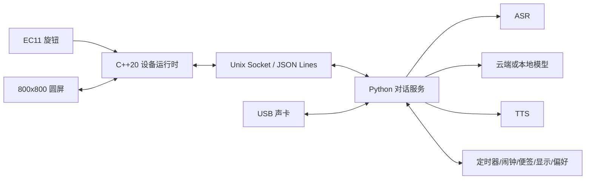

# HoloPet

<p align="center">
  <strong>简体中文</strong> · <a href="README_EN.md">English</a>
</p>

[](https://github.com/fieldfish/HoloPet/actions/workflows/ci.yml)
[](https://github.com/fieldfish/HoloPet/releases)
[](LICENSE)

HoloPet 是一个面向 Raspberry Pi 5 的开源桌面宠物项目。它把圆形屏幕、EC11 旋钮、USB 麦克风与扬声器、语音对话、离线功能和可打印外壳组合在同一套软硬件架构中。

> 一个具备语音感知、模型路由、受控工具调用与设备执行闭环的实体 AI Agent。

当前公开版本：**v0.9.0 Public Preview**


## 主要能力

- C++20 设备运行时：显示、GPIO、旋钮输入、状态机和本地功能均由设备侧程序负责。
- Python 对话服务：提供 ASR、LLM、TTS、工具调用、确认门、有限记忆和模型路由。
- 九种简约蓝色表情：开心、惊讶、馋、为难、无语、喜悦、生气、疑问、可爱。
- 微动画：空闲时随机眨眼，思考时改变视线与嘴型，说话时按音频电平驱动嘴型。
- 方形列表菜单：时钟、定时器、闹钟、便签和模型模式，可通过 EC11 旋转、短按和长按操作。
- 云端与本地模型：支持 OpenAI-compatible 接口、DeepSeek 配置示例和本地 OpenAI-compatible 服务。
- 语音链路：ALSA 录音/播放、火山引擎流式 ASR 与 OpenAI-compatible ASR/TTS 适配器。
- 紧凑机械设计 V3：126 mm 主体外径（旋钮局部约 128.5 mm），包含圆屏、Pi 5、双扬声器、70 mm 麦克风/音频组件及两端各 10 mm 弯折余量、旋钮和玻璃罩收口。

## AI Agent 核心

HoloPet 的 AI 部分不只是把问题转发给聊天模型。`holopet_agentd` 负责组织一轮完整的“理解—决策—执行—反馈”流程，并通过 Unix Socket 把工具请求交给 C++ 设备运行时执行。

```text
语音输入 → ASR → 模型路由 → Agent 工具循环 → C++ 设备功能
        → 工具结果 → 最终回答 → 屏幕表情 / 文本 / TTS
```

| 能力 | 实现 |
|---|---|
| 模型路由 | 按问题复杂度选择快速、深度或本地模型；支持用户显式切换，快速模型能力不足时最多升级一次 |
| 受控工具调用 | 统一目录包含 23 项工具，覆盖定时器、闹钟、时钟、便签、显示模式、AI模式、音量、表情和偏好记忆 |
| 安全执行 | 工具白名单、严格参数Schema、副作用分级、超时控制以及“删除全部”二次确认 |
| 有界推理 | 最多4个工具轮次、每轮最多4项工具、整轮最多8次执行，避免无限循环和失控调用 |
| 设备闭环 | Python Agent生成结构化工具请求，C++执行本地功能并回传结果，再由Agent组织最终回答 |
| 有限记忆与审计 | 只保存受控偏好；对路由、工具和状态变化进行结构化记录，不默认写入完整语音转写 |

核心实现位于 [`agent/holopet_agentd/agent/`](agent/holopet_agentd/agent/)，模型路由位于 [`router/`](agent/holopet_agentd/router/)，工具目录与策略位于 [`tools/`](agent/holopet_agentd/tools/)；C++侧的工具桥接位于 [`src/features/tool_bridge.hpp`](src/features/tool_bridge.hpp)。

## 界面

| 表情系统 | 方形菜单 |
|---|---|
|  |  |

界面使用纯黑背景和 `RGB(64,160,255)` 主色。表情与菜单均由 SDL2 图元实时绘制，不依赖外部角色图片或私有素材。

## 架构



C++ 与 Python 的职责边界、消息顺序和主要模块见 [架构说明](docs/ARCHITECTURE.md)。

## 当前状态

| 范围 | 状态 |
|---|---|
| Windows 核心干净构建与 C++ 测试 | 46/46 PASS |
| Windows AI/SDL 干净构建与 C++ 测试 | 50/50 PASS |
| Python 对话服务测试 | 共 312 项：290 PASS、22 项平台相关测试 SKIP，0 FAIL/ERROR |
| 表情、方形菜单、本地功能与 Agent 逻辑 | 已进入生产源码并具备自动化测试 |
| 最新 Agent 多步骤真实场景 | **Pi 重新验证中**，不以桌面测试替代实机结论 |
| 紧凑底座 CAD/STL | 参数化导出与网格检查通过 |
| 紧凑底座实物装配与光学效果 | **WAITING**，首件装配后确认 |

本仓库坚持区分“代码通过”“实机通过”和“机械实物通过”。机械尺寸与打印边界见 [机械设计说明](mechanical/compact_base_v3/README.md)；V2 仍作为历史基线保留。

## 目录

```text
src/                         C++ 设备运行时、显示、输入与本地功能
agent/holopet_agentd/        Python 对话服务与 Provider
ai_worker/                   兼容启动入口
config/                      无密钥示例配置
scripts/                     构建、部署、服务与本地模型脚本
systemd/                     Raspberry Pi systemd 服务模板
tests/                       C++ 与协议测试
mechanical/compact_base_v3/  当前参数化机械设计和可打印 STL（V2 历史基线）
docs/                        架构、界面、硬件与隐私说明
```

## 快速开始

### 1. 核心构建与测试

```bash
cmake -S . -B build-core -DBUILD_TESTS=ON -DCMAKE_BUILD_TYPE=Release
cmake --build build-core -j
ctest --test-dir build-core --output-on-failure
```

### 2. Python 对话服务

```bash
python3 -m venv .venv
source .venv/bin/activate
python -m pip install -r agent/requirements.txt
PYTHONPATH=agent python -m unittest discover -s agent/holopet_agentd/tests -t agent
PYTHONPATH=agent python -m holopet_agentd --config config/agent.example.json --fake
```

`--fake` 用于离线开发，不访问外部服务。真实 Provider 的 Key 只允许通过环境变量或权限受控的系统环境文件注入。

### 3. Raspberry Pi 全功能构建

安装 CMake、C++20 编译器、SDL2、SDL2_ttf、libgpiod 2.x、Python 3、ALSA 工具后：

```bash
cmake -S . -B build-pi \
  -DBUILD_TESTS=ON \
  -DBUILD_HARDWARE=ON \
  -DBUILD_DISPLAY=ON \
  -DBUILD_INTEGRATED=ON \
  -DBUILD_AI=ON \
  -DBUILD_AUDIO=ON \
  -DBUILD_PROJECTION=ON \
  -DCMAKE_BUILD_TYPE=Release
cmake --build build-pi -j
ctest --test-dir build-pi --output-on-failure
```

服务安装脚本位于 `scripts/install_service.sh`。在执行前请先阅读脚本并准备本机设备名、配置文件和环境变量。

## 配置与隐私

- 不要把 Key、真实 `.env`、录音、数据库、对话日志或模型权重提交到仓库。
- `config/` 中只提供无密钥示例；真实配置建议权限设为 `0600`。
- 本地记忆数据库、音频临时文件和运行日志均已写入 `.gitignore`。
- 公开仓库前仍应启用 GitHub secret scanning 与 push protection。

详细说明见 [隐私与数据边界](docs/PRIVACY.md) 和 [安全策略](SECURITY.md)。

## 机械打印

打印文件位于 `mechanical/compact_base_v3/stl/`。建议先打印 `fit_test/screen_body_fit_coupon.stl`，确认屏幕、主筒和顶部收口配合，再打印整套结构件。

参考总成 STL 用于查看屏幕、Pi、声卡、扬声器、旋钮和玻璃罩的装配关系，**不可当作打印件发送给商家**。

## 参与项目

欢迎提交 Issue 和 Pull Request。请先阅读 [贡献指南](CONTRIBUTING.md)。安全问题请按照 [SECURITY.md](SECURITY.md) 私下报告，不要在公开 Issue 中粘贴密钥、对话内容或设备信息。

## 许可证

除 [第三方声明](THIRD_PARTY_NOTICES.md) 中列出的外部依赖外，本仓库的软件源码、OpenSCAD、STL、界面设计与文档统一采用 [Apache License 2.0](LICENSE)。

项目名称及第三方服务名称可能涉及各自权利人的商标。本项目与 Raspberry Pi、DeepSeek、火山引擎、SiliconFlow、SDL 或其他服务商不存在官方隶属或背书关系。
