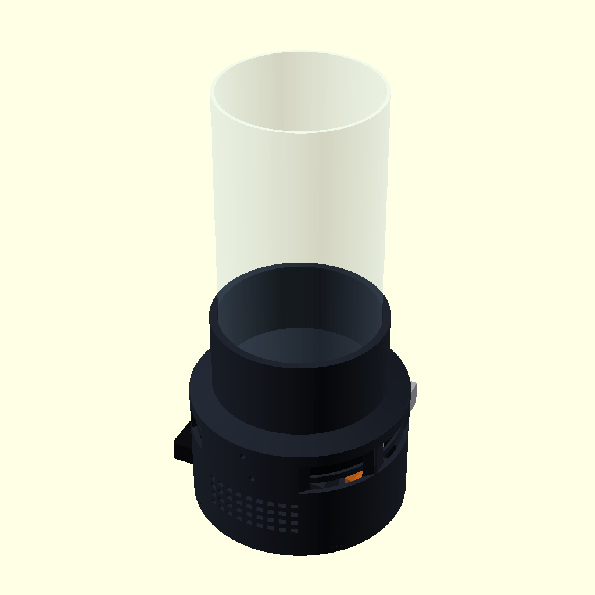
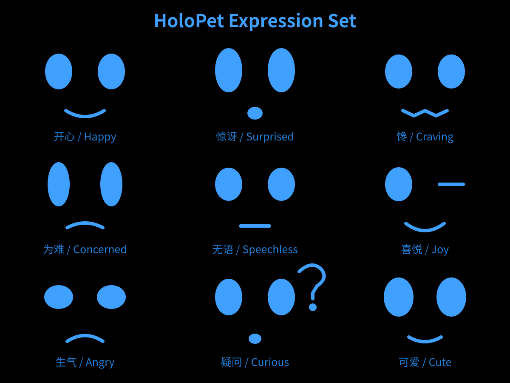
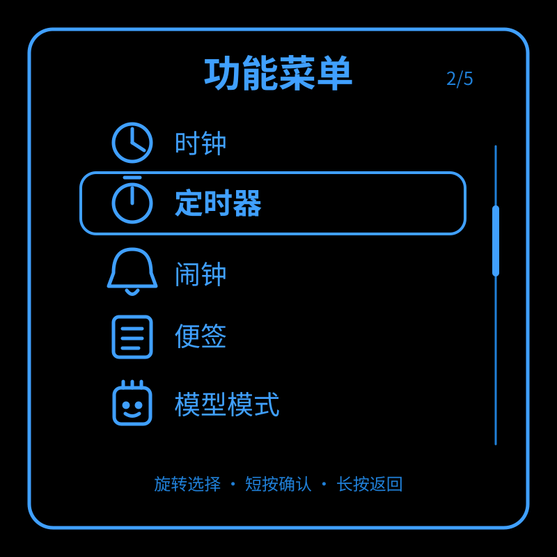
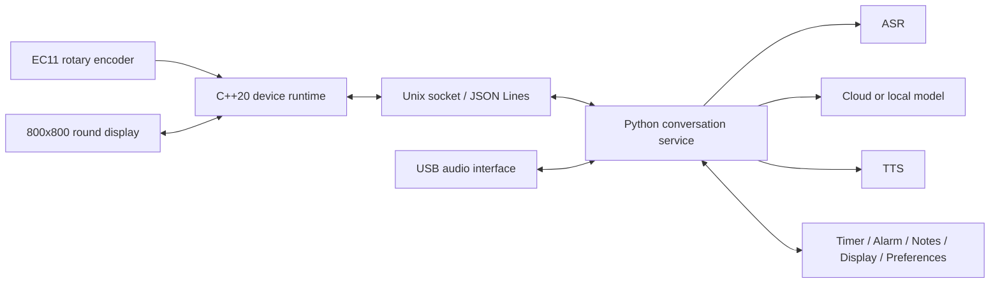

# HoloPet

<p align="center">
  <a href="README.md">简体中文</a> · <strong>English</strong>
</p>

[](https://github.com/fieldfish/HoloPet/actions/workflows/ci.yml)
[](https://github.com/fieldfish/HoloPet/releases)
[](LICENSE)

HoloPet is an open-source desktop companion built for Raspberry Pi 5. It combines a round display, an EC11 rotary encoder, USB microphone and speakers, voice interaction, offline utilities, and a printable enclosure in one hardware-software architecture.

> A physical AI Agent with voice perception, model routing, controlled tool use, and a closed device-execution loop.

Current public version: **v0.9.0 Public Preview**



## Highlights

- **C++20 device runtime:** display, GPIO, rotary input, state machines, and local utilities run on the device side.
- **Python conversation service:** ASR, LLM, TTS, tool calls, confirmation gates, bounded memory, and model routing.
- **Nine minimalist blue expressions:** happy, surprised, craving, troubled, speechless, delighted, angry, curious, and playful.
- **Subtle animation:** randomized idle blinking, thinking gaze and mouth changes, and audio-level-driven speaking animation.
- **Square list menu:** clock, timer, alarm, notes, and model mode, operated through EC11 rotation, short press, and long press.
- **Cloud and local models:** OpenAI-compatible endpoints, a DeepSeek configuration example, and local OpenAI-compatible services.
- **Voice pipeline:** ALSA capture/playback, Volcengine streaming ASR, and OpenAI-compatible ASR/TTS adapters.
- **Compact mechanical design V3:** 126 mm main-body outer diameter (about 128.5 mm locally at the knob boss), with a round display, Raspberry Pi 5, two speakers, a 70 mm microphone/audio assembly plus 10 mm cable-bend reserve at each end, rotary control, and glass-dome collar.

## AI Agent core

HoloPet does more than forward a prompt to a chat model. `holopet_agentd` coordinates a complete understand-decide-act-feedback turn and sends structured tool requests to the C++ device runtime through a Unix socket.

```text
Voice → ASR → Model routing → Agent tool loop → C++ device feature
      → Tool result → Final response → Expression / Text / TTS
```

| Capability | Implementation |
|---|---|
| Model routing | Selects fast, strong, or local models by task complexity; supports explicit user overrides and at most one controlled fast-to-strong escalation |
| Controlled tool use | A unified 23-tool catalog covers timers, alarms, clock mode, notes, display mode, AI mode, volume, expressions, and bounded preference memory |
| Safe execution | Allowlisted tools, strict argument schemas, side-effect classification, timeouts, and confirmation for destructive “delete all” operations |
| Bounded reasoning | At most 4 tool rounds, 4 tools per round, and 8 executions per turn prevent unbounded loops and runaway calls |
| Device feedback loop | The Python Agent emits a structured request, C++ performs the local action and returns its result, and the Agent then produces the final response |
| Bounded memory and audit | Stores controlled preferences only; records routing, tool, and state transitions without logging full speech transcripts by default |

The core implementation lives in [`agent/holopet_agentd/agent/`](agent/holopet_agentd/agent/), model routing in [`router/`](agent/holopet_agentd/router/), and tool definitions and policy in [`tools/`](agent/holopet_agentd/tools/). The C++ device bridge is implemented in [`src/features/tool_bridge.hpp`](src/features/tool_bridge.hpp).

## Interface

| Expression system | Square menu |
|---|---|
|  |  |

The UI uses a pure-black background and `RGB(64,160,255)` as its primary color. Expressions and menus are rendered in real time with SDL2 primitives, without external character artwork or private visual assets.

## Architecture



See [Architecture](docs/ARCHITECTURE.md) for the C++/Python responsibility boundary, message flow, and major modules.

## Validation status

| Scope | Status |
|---|---|
| Clean Windows core build and C++ tests | 46/46 PASS |
| Clean Windows AI/SDL build and C++ tests | 50/50 PASS |
| Python conversation-service tests | 312 collected: 290 PASS, 22 platform-specific SKIP, 0 FAIL/ERROR |
| Expressions, square menu, local features, and Agent logic | Implemented in production source with automated tests |
| Latest multi-step Agent scenarios | **Raspberry Pi revalidation in progress**; desktop tests are not presented as device evidence |
| Compact-base CAD/STL | Parametric export and mesh checks passed |
| Physical assembly and optical result | **WAITING** for first-article fit and projection inspection |

The project deliberately separates code-level validation, real-device validation, and physical/mechanical validation. See [Mechanical design](mechanical/compact_base_v3/README.md) for dimensions and printing boundaries; V2 remains available as the historical baseline.

## Repository layout

```text
src/                         C++ device runtime, display, input, and local features
agent/holopet_agentd/        Python conversation service and providers
ai_worker/                   Compatibility launcher
config/                      Credential-free example configuration
scripts/                     Build, deployment, service, and local-model scripts
systemd/                     Raspberry Pi systemd service templates
tests/                       C++ and protocol tests
mechanical/compact_base_v3/  Current parametric enclosure and printable STL files (V2 historical baseline)
docs/                        Architecture, UI, hardware, and privacy documentation
```

## Quick start

### 1. Core build and tests

```bash
cmake -S . -B build-core -DBUILD_TESTS=ON -DCMAKE_BUILD_TYPE=Release
cmake --build build-core -j
ctest --test-dir build-core --output-on-failure
```

### 2. Python conversation service

```bash
python3 -m venv .venv
source .venv/bin/activate
python -m pip install -r agent/requirements.txt
PYTHONPATH=agent python -m unittest discover -s agent/holopet_agentd/tests -t agent
PYTHONPATH=agent python -m holopet_agentd --config config/agent.example.json --fake
```

`--fake` is intended for offline development and does not contact external services. Real provider credentials must be supplied through environment variables or a permission-restricted system environment file.

### 3. Full Raspberry Pi build

After installing CMake, a C++20 compiler, SDL2, SDL2_ttf, libgpiod 2.x, Python 3, and ALSA tools:

```bash
cmake -S . -B build-pi \
  -DBUILD_TESTS=ON \
  -DBUILD_HARDWARE=ON \
  -DBUILD_DISPLAY=ON \
  -DBUILD_INTEGRATED=ON \
  -DBUILD_AI=ON \
  -DBUILD_AUDIO=ON \
  -DBUILD_PROJECTION=ON \
  -DCMAKE_BUILD_TYPE=Release
cmake --build build-pi -j
ctest --test-dir build-pi --output-on-failure
```

The service installer is available at `scripts/install_service.sh`. Review it and prepare the device names, configuration, and environment variables before running it.

## Configuration and privacy

- Never commit API keys, real `.env` files, recordings, databases, conversation logs, or model weights.
- `config/` contains credential-free examples only; real configuration should normally use `0600` permissions.
- Local memory databases, temporary audio, and runtime logs are covered by `.gitignore`.
- Enable GitHub secret scanning and push protection before accepting outside contributions.

See [Privacy and data boundaries](docs/PRIVACY.md) and the [Security policy](SECURITY.md).

## Mechanical printing

Printable parts are under `mechanical/compact_base_v3/stl/`. Print `fit_test/screen_body_fit_coupon.stl` first to verify the display, main body, and upper collar before ordering the complete set.

Reference assembly STL files illustrate the relationship between the display, Raspberry Pi, audio interface, speakers, rotary control, and glass dome. They are **not printable parts and must not be sent to a printing vendor as production files**.

## Contributing

Issues and pull requests are welcome. Please read [CONTRIBUTING.md](CONTRIBUTING.md) first. Report security concerns privately according to [SECURITY.md](SECURITY.md); never paste credentials, conversation content, or device information into a public issue.

## License

Except for external dependencies listed in [Third-party notices](THIRD_PARTY_NOTICES.md), the source code, OpenSCAD files, STL files, UI design, and documentation in this repository are licensed under the [Apache License 2.0](LICENSE).

Project and service names may be trademarks of their respective owners. HoloPet is not officially affiliated with or endorsed by Raspberry Pi, DeepSeek, Volcengine, SiliconFlow, SDL, or any other service provider.
