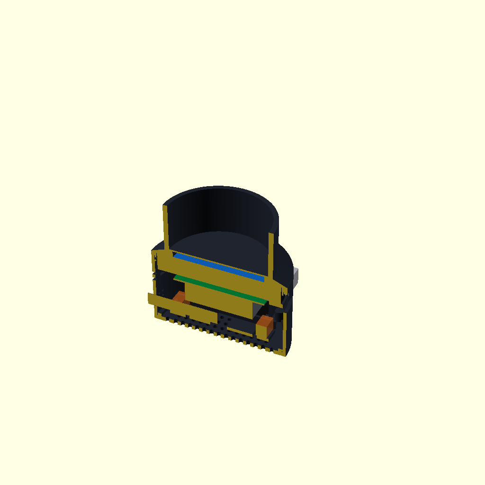
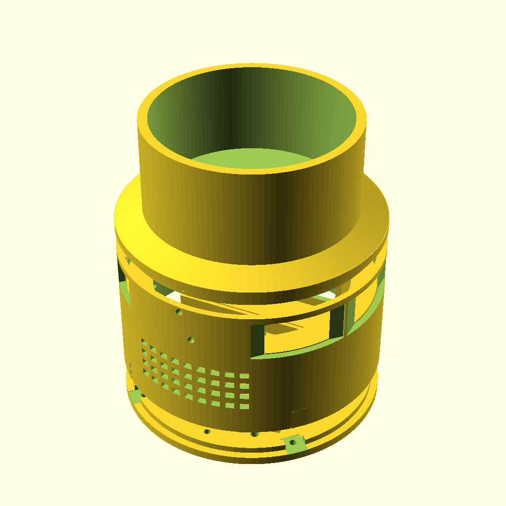

# Compact Base V3

Compact Base V3 是在 V2 基础上按实物接口复核后的紧凑底座机械版本。模型采用参数化 OpenSCAD 源码，包含可打印结构件、配合样件、装配代理体和预览图。V2 保留在仓库中作为历史基线，V3 才是本次重新打印候选。

## 名义尺寸

| 项目 | 尺寸 |
|---|---:|
| 底座最大外径 | 126 mm |
| 主筒高度 | 65 mm |
| 电子舱主筒高度 | 65 mm |
| 加长遮光套后最大打印件总高 | 119 mm |
| 主筒内径 / 壁厚 | 120 / 3 mm |
| 圆屏包络 | Ø115×17 mm |
| 屏幕后方至散热器最低点 | 25 mm |
| Pi 与屏幕隔离柱 | 5 mm |
| 单个扬声器包络 | 70×30×20 mm |
| 麦克风/音频件本体包络 | 70×28×12 mm |
| 麦克风/音频件总留空（两端含弯折余量） | 90×28×12 mm |
| 玻璃罩 | OD90 / ID86 / H180 mm |
| EC11 面板孔 | Ø7.3 mm |
| EC11 外侧压紧座 | Ø21×2.5 mm |

35 mm 加长部分位于 Ø100 外侧遮光套筒，不是空电子舱。玻璃下部总遮挡约 45 mm；内部只保留约 1.5 mm 承托肩，上方内孔为 Ø91.2，最窄光学口为 Ø84.5。V3 不增加电子舱高度，90 mm 音频留空沿水平方向展开。

## 文件

`stl/` 中的七个文件为打印件：

1. `01_main_shell.stl`
2. `02_top_collar.stl`
3. `03_screen_rear_retainer.stl`
4. `04_pi_spacers_5mm_x4.stl`
5. `05_audio_component_carrier.stl`
6. `06_bottom_cover.stl`
7. `07_ec11_knob.stl`

`fit_test/screen_body_fit_coupon.stl` 用于先行确认屏幕、主筒和顶部收口配合。

`reference/` 中的 STL 含屏幕、Pi、散热器、扬声器、声卡、EC11 和玻璃罩代理体，**只用于查看装配关系，不可打印**。

## V3 接口与固定修订

- 两只 70×30×20 mm 扬声器保留在同一垂直高度带，分别朝向圆筒两侧；
- 70 mm 麦克风/音频件横放在底层，前后各预留 10 mm 线材弯折区，总留空 90 mm；
- Pi USB/Ethernet 在 +X 侧独立开口；
- Pi USB-C 电源与 HDMI 在 315° 侧独立服务开口；
- 屏幕电源在 225° 侧另设独立开口，不与 Pi 电源共用；
- EC11 轴孔仍为 Ø7.3 mm，增加 Ø21×2.5 mm 外侧平面压紧座、内部加强垫和 Ø2.2 mm 防转孔，便于螺母和垫片固定；
- 屏幕、Pi 和散热器位于上层中央；
- EC11 位于 +Y 侧上部，避开扬声器高度带；
- 本版本不包含反射片支架；
- 顶部薄遮光套位于玻璃外侧，避免厚内壁遮挡投影。

所有接口开口均保留线材插拔和维护余量，但最终位置仍需用真实 Pi、屏幕电源线、麦克风/声卡和插头首件确认。

## 打印建议

- FDM，黑色 PETG；
- 0.4 mm 喷嘴，0.20 mm 层高；
- 4 道壁，顶部/底部至少 5 层；
- 25% Gyroid 填充；
- 单位 mm，缩放 100%，禁止自动缩放到平台；
- 顶部收口窄颈朝打印床，屏幕托肩允许局部树状支撑；
- 避免在 Ø91.2 玻璃孔内生成难以清理的致密支撑。

## 验证边界

公开文件已经完成参数化导出、接口开口检查和 STL 网格检查。PETG 收缩、玻璃圆度、扬声器孔距、麦克风线束弯曲半径、Pi/屏幕两个电源口插拔、音频载架滑配以及真实光学效果仍需首件实测，因此当前状态为 `PHYSICAL_FIT=WAITING`、`OPTICAL_PASS=WAITING`。

