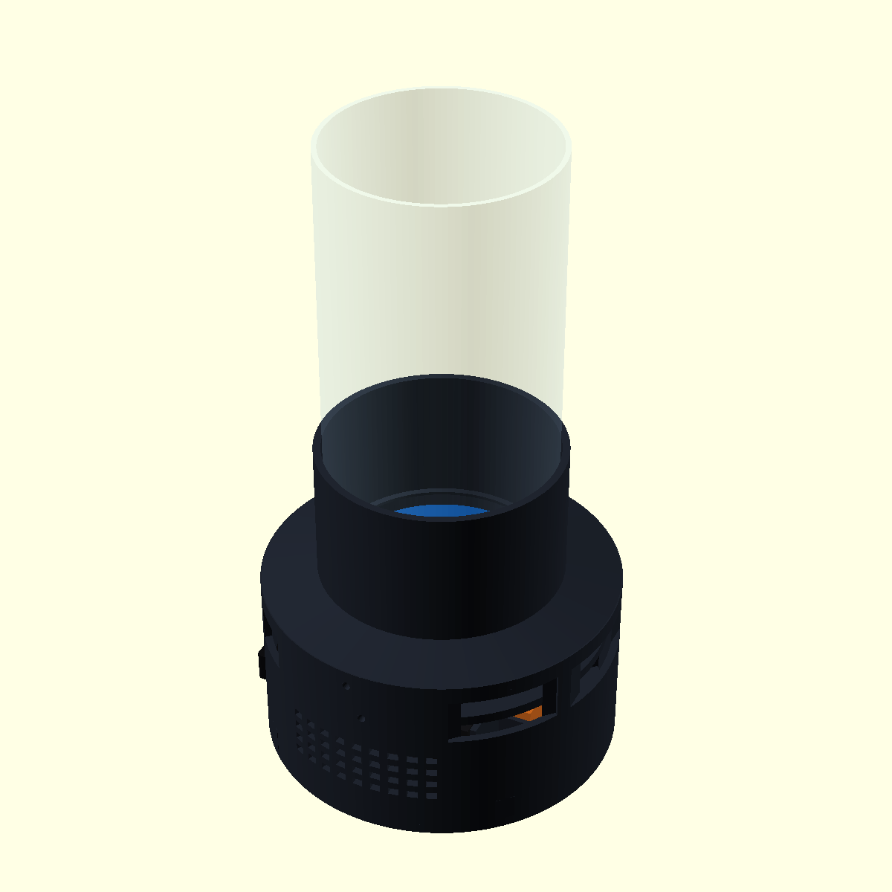
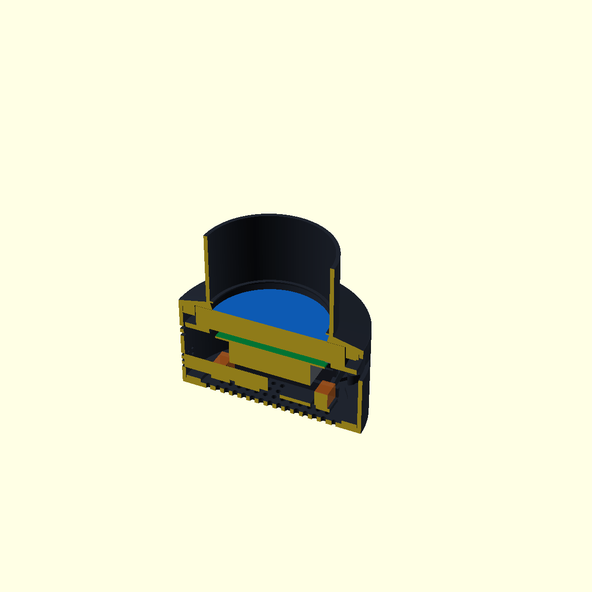
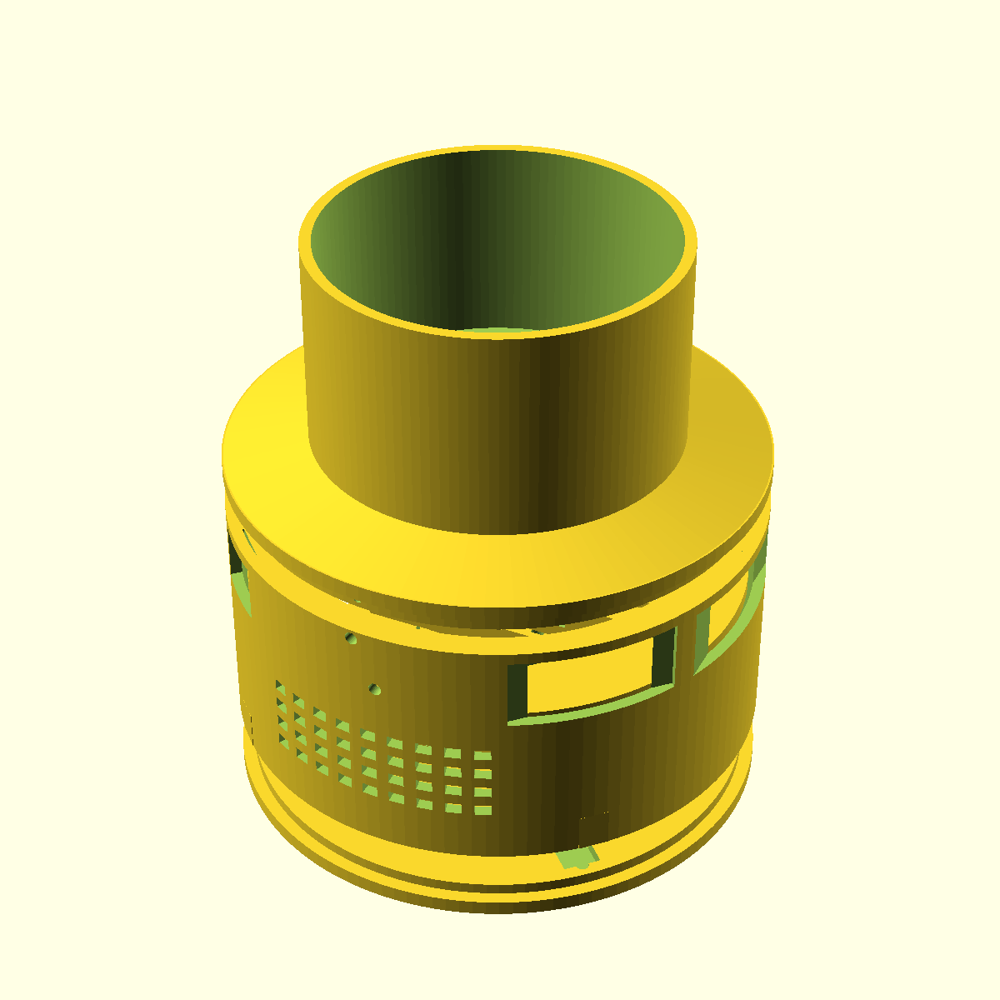

# Compact Base V4

Compact Base V4 是针对 V3/V3.1 首批打印问题重建的实物装配候选。V3/V3.1 存在顶部承托层封死通光口、扬声器净空间不足、载架与筒壁余量过小、缺少扬声器通线口以及旋钮过大的问题，禁止继续送印。

V4 仍未取得真实装配与投影确认，状态为 `PHYSICAL_FIT=WAITING_RETEST`、`OPTICAL_PASS=WAITING_RETEST`。

## 关键尺寸

| 项目 | V4 尺寸 |
|---|---:|
| 主体外径 / 内径 / 壁厚 | Ø142 / Ø136 / 3 mm |
| 主筒高度 | 65 mm |
| 加长遮光套后的装配总高 | 129 mm |
| 圆屏包络 / 屏幕孔 | Ø115×17 / Ø116.2 mm |
| 屏幕后方至散热器最低点 | 25 mm |
| Pi 与屏幕隔离柱 | 5 mm |
| 单个扬声器实物包络 | 70×30×20 mm |
| 单个扬声器净空 | 72×32×22 mm |
| 扬声器通线口 | 两端及背部，14×10 mm |
| 麦克风/音频件本体 | 70×28×12 mm |
| 麦克风/音频件总留空 | 90×28×12 mm |
| 玻璃外径 / 内径 | Ø90 / Ø86 mm |
| 玻璃插入孔 | Ø91.2 mm |
| 连续通光孔 | Ø86 mm |
| 玻璃外侧套筒 | Ø97.2 mm，径向壁厚 3 mm |
| EC11 旋钮 | Ø18×12 mm，Ø6.25 D 形贯通孔 |

## 已纠正的问题

- 顶部件中心现在具有贯穿全高的 Ø86 mm 通光孔；
- 屏幕上方采用 Ø87.6→Ø91.2 的扩张通光锥，Ø86 最窄处仅保留在 1.5 mm 环形承托层中；
- 顶部收口取消贯穿侧壁的线缆缺口，保持完整 360° 闭环；
- 屏幕后压环恢复为完整闭合圆环，线缆改走 Ø94 中央孔和外壳服务口；
- 主体内径从 Ø120 增加至 Ø136 mm；
- 音频载架实算最大半径 65 mm，相对 68 mm 内半径保留 3 mm；
- 扬声器净长从错误的约 66 mm 增加到 72 mm，可容纳 70 mm 本体；
- 两端和背部均加入 14×10 mm 通线口；
- 旋钮从 Ø25.5 mm 缩小到 Ø18 mm，D 形轴孔改为贯通；
- EC11 外侧压紧座从 Ø21 mm 缩小到 Ø18 mm。

## 文件

`stl/` 中的七个文件为完整打印件：

1. `01_main_shell.stl`
2. `02_top_collar.stl`
3. `03_screen_rear_retainer.stl`
4. `04_pi_spacers_5mm_x4.stl`
5. `05_audio_component_carrier.stl`
6. `06_bottom_cover.stl`
7. `07_ec11_knob.stl`

低成本配合测试件：

- `fit_test/screen_body_fit_coupon.stl`
- `fit_test/speaker_fit_coupon.stl`

`reference/` 中的总成仅供查看，不可送印。

## 送印顺序

1. 先打印两个 `fit_test/` 测试件；
2. 用真实玻璃确认 Ø91.2 插入配合与 Ø86 通光；
3. 用真实扬声器确认 72×32×22 mm 净空和三个通线方向；
4. 只在以上两项通过后打印 `02_top_collar.stl` 与 `05_audio_component_carrier.stl`；
5. 完成筒内装配路径检查后再打印主壳与底盖。

## 验证边界

当前已完成参数化导出、STL 水密性、正体积、中心通光、旋钮贯通孔以及载架径向余量的静态检查。真实 PETG 收缩、扬声器壳体圆角、接线端高度、玻璃圆度、插头弯曲半径和投影边缘仍需实物复验。

